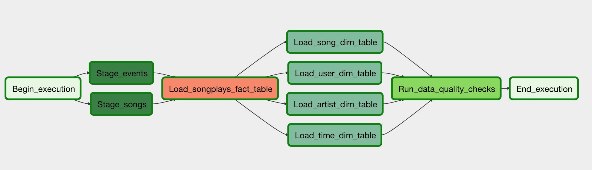

# Data-Pipeline-With-Airflow
Data Pipeline With Airflow, AWS

A music streaming company, Sparkify, has decided that it is time to introduce more automation and monitoring to their data warehouse ETL pipelines and come to the conclusion that the best tool to achieve this is Apache Airflow.

In this project, Need to create custom operators to perform tasks such as staging the data, filling the data warehouse, and running checks on the data as the final step.

Main file -> Airflow -> dags

Other file -> Airflow -> Plugins ->  1. helpers
                                     2. operators

- Copying Data from S3

- Configuring Redshift

- Configuring Airflow

- Setting Up Airflow Connections with AWS 

- Creating the Dag
